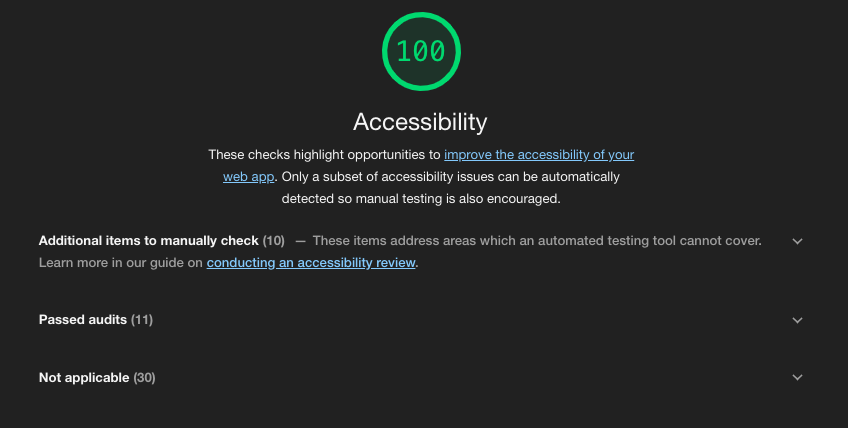
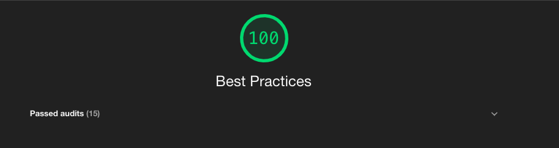
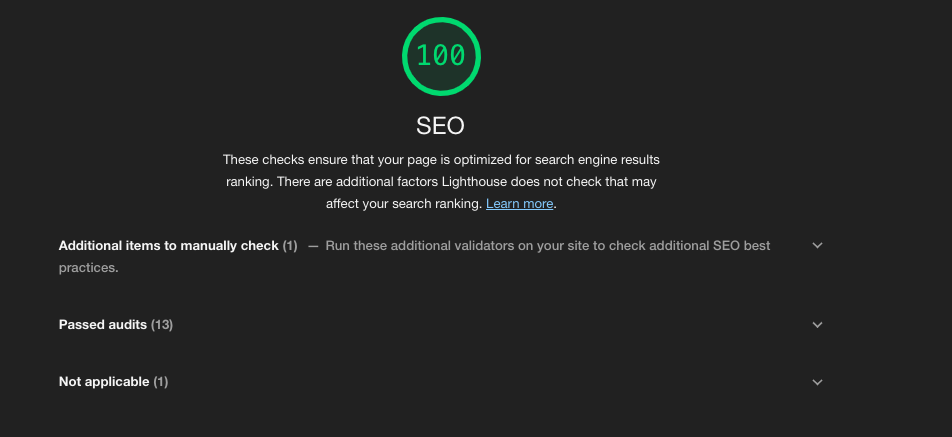

# SpaceX Launches

Application list down all the launches by spaceX.
User can also filter the results based on Launch Year, Successful Launc or Success Landing.

## Key Points
---

*   App supports Server Side Rendering
*   User can filter results (launch year, launch success and success landing)
*   Filter configuration is stored in localstorage hence, filters are not disturbed event after page refresh
*   Design is fully responsive and follows Mobile First approach.

## How to Run
---

1) Goto application directory
2)  yarn install
3)  yarn start

App will be hosted on localhost port 3030 (if port is not specified in process env)

## Create production build
---

1) Goto application directory
2) yarn build
3) node build

App will be hosted on localhost port 3030 (if port is not specified in process env)

## Git repository
---

 https://git.heroku.com/spacex-launche.git

## Deployment
---

App is live and deployed at [spacex](https://spacex-launche.herokuapp.com/) https://spacex-launche.herokuapp.com/

## Performance Measures
---

